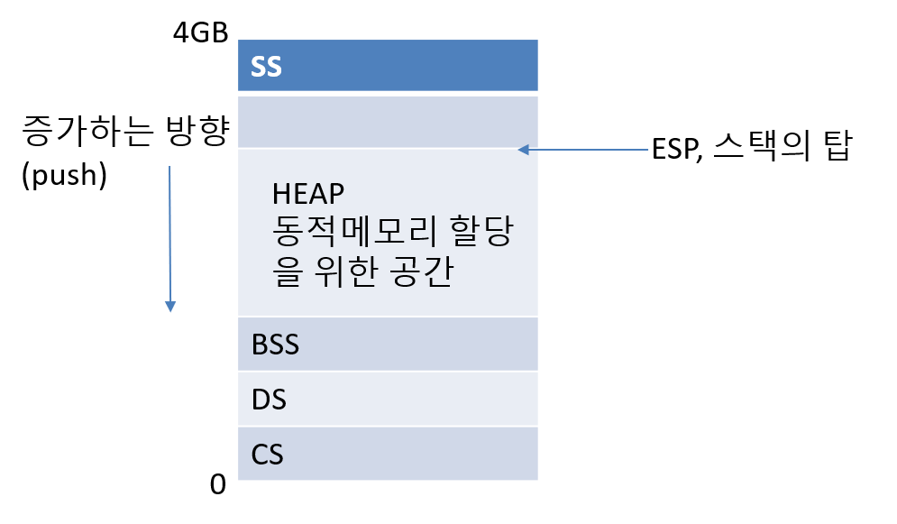

### 스택의 목적?  
스택은  
1. subprogram 의 호출에서 리턴되는 주소를 저장하고,  
2. subprogram 에 매개변수를 전달하고, (C의 함수 호출을 포함해서)  
3. subprogram 에서 쓰일 지역 변수들을 할당하고,  
4. subprogram 들 간에서 보전되는 레지스터들을 저장하는데 쓰이는 메모리의 일부이다.  

함수를 호출하면 그 호출 당시의 레지스터에 있는 변수는  
전부 백업이 된다. 레지스터를 저장하는 데에도 스택이 사용된다는 것이다.  

함수 기반의 프로그램은 무조건 스택으로 이루어져있다.  

ESP 가 가리키는 부분은 스택의 Top 이다.  
즉, 가장 최근에 시작된 주소이다.  

프로그램이 실행이 되면 운영체제가 이에게 스택 공간을 마련해준다.  
마련된 그 공간의 top을 esp 가 가리키도록 만들어준다.  


## Push 와 Pop
ESP 레지스터는 Stack Pointer 이다.  
스택의 Top을 항상 가리키고 있다.  

```nasm
push eax
``` 

```nasm
sub esp, 4
mov [esp], eax
```

위 둘은 정확히 같은 동작을 한다.  

또한,

```nasm
pop ebx
```

```nasm
mov ebx, [esp]
add esp, 4
```
도 그렇다.  

이때, eax, ebx 순으로 push 했으면  
pop 은 ebx, eax 순으로 해야 각 레지스터에 값이 보존된다.  

스택의 모양



## Call 과 Ret 
call 은 하나의 operand 로 작동한다.  
이 operand 는 함수의 시작 주소, 즉 label 을 갖는다.  
call 은 다음번 명령의 주소를 스택에 push 하고 무조건 분기한다.  

반면, ret은 operand 가 없다.  
stack 에서 top을 pop 한 다음 그곳으로 간다.  
따라서 프로그램이 꼬이지 않으려면 stack 에 올바른 값이 있어야 한다.  
그래야 ret 에서 pop 한 값이 올바른 주소가 된다.  


## 함수 호출 규칙  
1. call and return  
subprogram 은 call 명령어로 불리고 ret 으로 return 된다.  

2. parameter passing    
- 매개변수는 부르는 쪽이 push 해준다.  
- 매개변수가 있는 스택은 subprogram 에서 ebp 를 이용해서 접근할 수 있다.  
- 매개변수는 부르는 쪽에서 지운다. 
- 함수는 스택에 있는 매개변수를 pop 해서 쓰지 않고, 이를 참조한다.  

3. 지역 변수  
- 지역변수는 스택에 할당된다.  
- 지역변수도 EBP 를 통해 접근할 수 있다.  

4. 반환되는 값은 EAX 레지스터로 전달된다.


## 매개변수 전달

호출할 때 호출 직전에  
push 3  
push 2  
push 1  
을 하고 호출한다. (parameter 순의 역순이다.)  

즉, 함수의 실행 때 스택에는  
3  
2  
1  
이 들어있다. 이때 스택에 담긴 상태로 변수를 참조하므로  
EBP 에 offset 을 달아서 변수를 참조한다.  

함수가 끝나면 ret 으로 종료 후,  
함수를 부른 측에서 매개변수를 지운다.  
왜냐하면 매개변수가 올 때와 갈 때가 다를 수가 있기 때문이다. (ex: printf)  
그래서 
