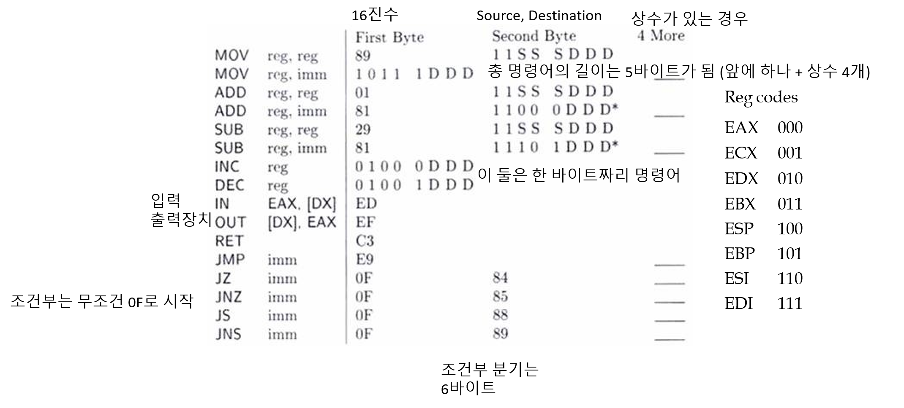
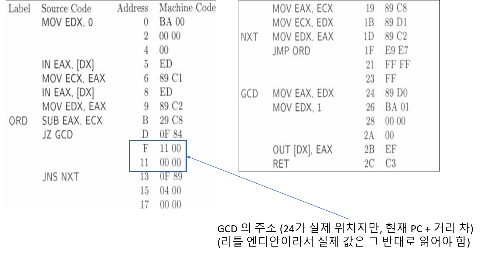

### Maching Language (기계어)

프로세서에게 보이는 언어이다.  
어셈블리어는 기계어를 특정한다.   
어셈블 - 어셈블리 코드를 기계어로 바꾸는 과정  
어셈블러 - 어셈블리어를 입력으로 받아 기계어를 만들어 출력하는 프로그램  






# 일반적인 기계 명령어 형식

접두사, op코드, ModRM(연산자 지정자), 주소/Displacement, 상수  
0 ~ 4   1 ~ 2       0 ~ 2                 0 ~ 4         0 ~ 4 바이트  

같은 mov 도 피연산자에 따라서 길이가 다르며,  
보통 1바이트부터 8바이트까지 다양하다. 


# Opcode 공간

기호와 피연산자에 대한 정보를 담는다.  

r : register    
m : memory  
i : immediate  
b : byte  
2 : 2 bytes  
v : 32 bits 혹은 16 bits  
e : E 가 있으면 32비트, 없으면 16비트  

예) op코드 89를 가지는 mov 명령어는 피연산자로 rmv 와 rv 를 가진다.  
이는 첫번째 연산자로 레지스터 혹은 메모리가 올 수 있고  
두번째 연산자로는 레지스터가 온다는 뜻이다. 그리고 그 크기는 32비트이다.  

명령어에 따라 op코드를 두 개 필요로 하는 게 있고, 피연산자가 없는 것도 있다.  
명령어의 첫번째 바이트는 어떤 동작을 하는지 지정한다.  
피연산자에 대한 정보를 담고 있지 않다.  
피연산자가 있는 명령어들은 ModRM 바이트를 따로 가진다.  
어떤 것은 두 개 가지기도 한다.  
혹은 prefix 바이트에 따라서 동작이 달라지기도 한다.  


## ModRM 바이트

Mod Reg R/M  
7 6 543 210  
의 비트가 할당이 된다.  

Mod 의 두 비트가 11이라면 R/M 비트는 레지스터를 지정한다.  
그게 아니라면 R/M 비트는 메모리 코딩을 할 때 사용된다.  

5, 4, 3번째 비트는 레지스터 비트이고 /r 을 붙여서 주로 지정된다.  

2, 1, 0번째 비트는 R/M 비트로, 모드 비트가 11일 때를 제외하면  
메모리 주소를 지정하거나 혹은 지정하는 걸 돕는데 사용된다.  


# 예시

```nasm
add edi, eax
```

- 두 Mod 비트는 11이다.  
- EDI 의 R 비트는 111이다.  
- EAX 의 R/M 비트는 000이다.  

따라서,  

Mod Reg R/M  
11  111 000  

위는 16진법으로 F8이고,  
add 의 opcode 가 03이므로  
`add edi, eax` 는 030F이 된다.  


# Mod 비트 사용법

- 11  
`add edi, eax` 와 같이, 레지스터와 레지스터와의 연산.  

- 00  
`add edi, [eax]` 실제 메모리 연산  

- 01과 10 (ib나 iv의 상수 displacement)  
01은 8비트, 10 은 32비트이다.  
```nasm
add edi, [eax + 5]
add edi, [eax + 87654321H]
```

특수한 경우로, R/M 부분에 101이 온다면  
이는 101 레지스터를 베이스로 하는 것이 아니라,  
뒤의 32비트 displacement 만 사용한다.  

하지만, 101은 또한 EBP 의 레지스터 코드이기도 한데,

`mov esi, [ebp]` 같은 경우엔,
ebp 에서 0만큼 움직인 것으로 가정하고, 
뒤에 0 짜리 displacement 를 넣는다.  

## 2바이트 주소 지정 방식 - 2바이트 ModRM
Base reg + Index reg + scale factor + displacement 의 형태일 때.  
앞의 ModRM 바이트의 R/M 위치에 100이 들어간다.  

그리고 두번째 ModRM 바이트의 첫 두 바이트는 scale factor로,  
2의 지수로 계산한다. 예를 들어 이것이 10이라면 2^2승인 4를 가리킨다.  

두번째는 인덱스가 되는 레지스터를 가리키고, 그 다음은 base 레지스터이다. 


## 레지스터가 아닌 R 비트

`sub ecx, 32`
와 같은 경우,  
83은 immed rmv, ib 의 명령어 코드,  
sub 명령어는 101 을 코드를 가지고  
이는 메모리가 아니라 레지스터의 연산이므로 Mod 는 11,  
32는 16진수로 20H 이므로  
위 코드는 기계어로  
83 11 101 001 20 -> 83 E9 20 이 된다.  

때론 어떤 것은 딱 하나의 명령어에 대응이 된다.  
ModRm 바이트는 피연산자의 정보를 필요로 할 수도 있다.  
XADD 명령어의 첫 두 바이트는 0F C1 이다.  

ModRM 바이트는 어떤 동작을 정하는데 쓰인다.  
0F 01 일 때, ModRM 의 R 비트를 확인해봐야 한다.  


# 32비트와 16비트

32비트 모드에서는 그냥 쓰면 32비트 레지스터로 처리하고,  
앞에 66을 붙이면 16비트로 작동한다.  

```nasm
mov ecx, eax
```
는 89 C1 으로 해독되고,

```nasm
mov cx, ax
```
는 66 89 C1 이다.  

16비트 모드에서는 정반대로 안 붙이면 16비트, 붙이면 32비트이다.  
따라서 16-32간의 레지스터 코드는 똑같다.  

하지만 8비트는 따로 있다.  
