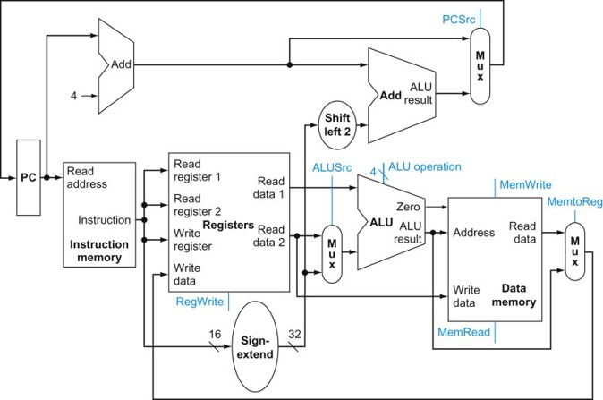
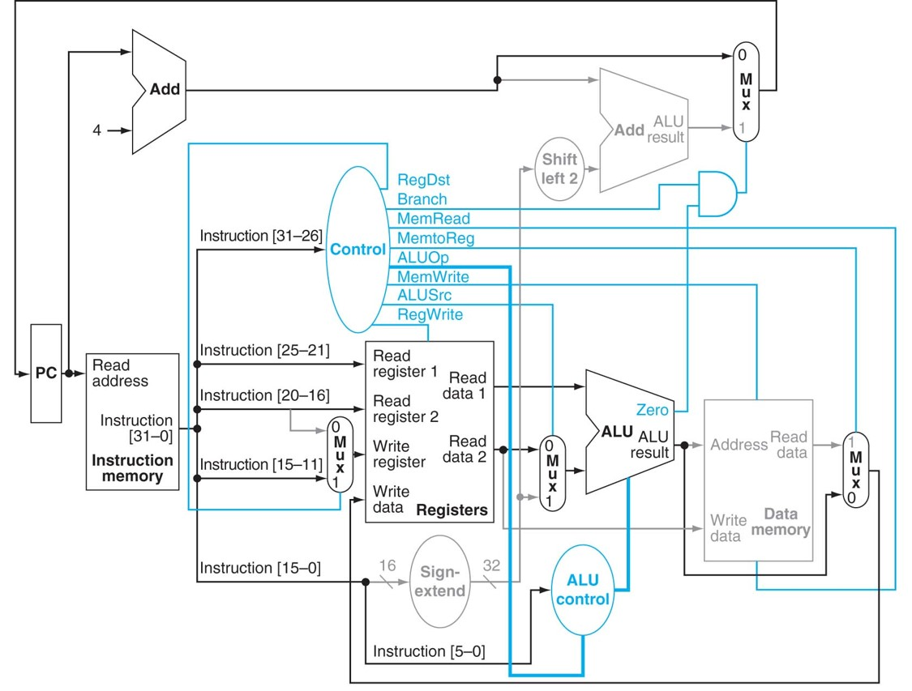

## 단일 데이터 패스

### 단일 사이클 데이터 패스 (Single-cycle Datapath) 
가장 간단한 데이터 패스이다.  
모든 명령어를 한 클럭 내에 실행한다. (CPI = 1)  
어느 데이터패스 자원도 명령어 당 두 번 사용되지 않는다.  
두 번 이상 사용할 필요가 있는 요소는 필요한 만큼 설치 (예 : beq 의 추가 ALU)

### 다른 명령어들의 데이터패스 구성 요소 공유  
구성 요소의 입력에 여러 개의 연결이 필요  
멀티플렉서를 이용해 여러 입력 중 하나 선택

위의 그림에선 MUX 총 세 개가 있다.  
왼쪽부터 1, 2, 3번이라고 할 때  

1번 MUX 는 레지스터 1과 2를 funct 에 맞춰 연산할 것인지, (0)  
아니면 뒤의 16비트가 부호확장된 값을 2번 레지스터와 더할 것인지 (1) 를 정한다.  
즉 R 타입 명령어가 지나가면 이것은 0, 아니면 1이다.  

2번 MUX 는 계산된 값이 PC에 들어갈지 말지를 정한다.  
PC에 16비트가 부호확장되고, 2번 왼쪽으로 쉬프트되고  
이와 PC + 4 를 더한 결과가 들어갈지, 즉 분기가 일어날지  
아니면 그냥 PC + 4 가 들어갈지, 즉 분기가 일어나지 않을지를 결정한다.  

3번 MUX 는 lw 에서 계산된 메모리 주소의 값이 Register 로 들어갈지 말지를 정한다.  
끝을 잘 보면 MUX 의 결과가 Register file의 Write Data 로 이어진 것을 확인할 수 있다.  

### ALU 제어

ALU 는 Arithmetic Logic Unit 이다.  
이곳에선 덧셈, 뺄셈, AND, OR 등의 모든 연산이 이루어진다.  
두 수를 입력받아 ALU 에서 뭘 할지를 알려주어야 하므로  
ALU op코드와 funct (fuction code) 로 ALU 를 제어한다.  

예컨데 R-Type 은 op코드가 000000 이므로  
맨 뒤에 추가적인 funct 코드 6비트로 그 확인이 필요하다.  
따라서 ALU op 2비트와 funct 6비트, 도합 8비트로 ALU 제어신호를 만든다.  

이때 ALU op 는 R 타입일 때 10, beq 이면 01, 메모리 참조일 땐 00을 갖는다.  

## 주 제어 유닛의 설계

명령어는 op | rs | rt | rd | shamt | funct |  
각각 6, 5, 5, 5, 5, 6비트이고  
R 타입이 아니라면 rd부터의 16비트는 offset 이나 (메모리 참조)  
주소로 쓰인다. (분기 명령어)  

따라서 op 로 명령어를 확인한 후  
rs, rt를 읽는다. (단, lw 는 이 레지스터의 값을 사용하지 않는다.)  
그리고 이것이 R 타입 명령어라면 rd 에 write,  
lw 라면 rt 에 write,  
sw 라면 rt 를 읽는다. (베이스 레지스터)  

그리고 R 타입이 아니라 메모리 참조나 분기 명령어라면  
뒤의 16비트 값을 부호확장 해서 rs 에 더하거나 (lw / sw)  
아니면 2번 쉬프트한 후 PC + 4 에 더한다. (beq)  

중요한 점은, 뒤의 16비트 주소 중 상위 5비트를 rd 로 읽고  
이 레지스터에 저장하는 불상사를 막기 위해 rd에 쓰지 말라고 (RegWrite)  
미리 구분을 해줘야 한다는 점이다.  

## 제어 신호의 기능

최종 데이터 패스는 이러하다.

명령어의 op코드 6비트가 Control 에서 위의 표에 맞는 값을 넣어 제어를 해주고  
ALU Op 에 맞는 코드가 ALU Control 로 제어하고 있다.  

## 각 명령어 별 데이터 패스와 제어 신호  

### R 형식

1. 명령어 인출 및 PC 증가  
2. 두 레지스터를 레지스터 파일에서 읽고 주 제어 유닛이 제어선 값 계산  
3. ALU는 funct 값을 사용해 제어신호 생성  
4. ALU 계산 결과를 rd에 기록

R 형식에서 Control 은 ALU Op 가 10이 들어간다.  
또한 유일하게 rd 를 읽으므로 RegDst 와,  
rs 와 rt 의 연산 결과를 rs 에 저장하므로 RegWrite 가 활성화된다.  

|RegDst|ALUSrc|MemtoReg|RegWrite|MemRead|MemWrite|Branch|ALUOp|
|:---:|:---:|:---:|:---:|:---:|:---:|:---:|:---:|
|1|0|0|1|0|0|0|10|

### 적재 (lw) 명령어

1 ~ 2 공통  
3. rs 레지스터와 하위 16비트의 부호확장된 값을 더해 주소 계산  
4. 계산된 주소로 가서 메모리 읽기  
5. rt에 저장  

lw 는 메모리 참조 명령어이므로 ALUOp 는 00일 것이고  
ALUSrc, 주소를 계산해야 하므로 활성화되고
메모리를 레지스터로 보내고, (MemToReg)  
레지스터에 쓰고 (RegWrite)  
메모리를 읽어야 하므로 (MemRead)  
해당 부분이 활성화 된다.  

|RegDst|ALUSrc|MemtoReg|RegWrite|MemRead|MemWrite|Branch|ALUOp|
|:---:|:---:|:---:|:---:|:---:|:---:|:---:|:---:|
|0|1|1|1|1|0|0|00|

### 저장 (sw) 명령어

1 ~ 3은 lw와 같음
4. 계산된 주소에 rt 값을 저장

sw 역시 메모리 참조이므로 ALUOp 는 00이다.  
주소를 계산하므로 ALUSrc 가 1이 되고
메모리에 쓰는 작업을 하므로 MemWrite 도 1이 된다.  
sw 는 레지스터 자체에 접근을 하지 않으므로 RegWrite 가 0이 되는데  
이때문에 뒤에 Reg이 붙는 모든 제어 신호는 어떤 값이 들어가든 상관이 없다.  
따라서 RegDst, MemToReg 는 Don't Care 가 된다.  

|RegDst|ALUSrc|MemtoReg|RegWrite|MemRead|MemWrite|Branch|ALUOp|
|:---:|:---:|:---:|:---:|:---:|:---:|:---:|:---:|
|X|1|X|0|0|1|0|00|

### 분기 명령어

1~2 공통  
3. rs에서 rt 를 뺀다. 이와 동시에 주소를 계산  
4. ALU 의 Zero 출력을 통해 PC에 넣을 값을 선택한다.  

이는 Branch 가 유일하게 1이 된다.  
그리고 레지스터나 메모리에 어떠한 값도 쓰지 않으므로  
RegWrite, MemWrite, MemRead 는 0이 되며  
sw 에서와 같은 원리로 RegDst, MemToReg 은 X 이다.  
ALUSrc 는 쓰이지 않으므로 0이다.

|RegDst|ALUSrc|MemtoReg|RegWrite|MemRead|MemWrite|Branch|ALUOp|
|:---:|:---:|:---:|:---:|:---:|:---:|:---:|:---:|
|X|0|X|0|0|0|1|01|

### 점프 명령어

점프 명령어는 뒤의 26비트 * 4 + PC+4의 상위 4비트로 주소를 계산한다.  
이를 위해선 새로운 shift left 2 유닛이 필요하다. (기존 것은 Branch 에서의 Add 유닛에 물려있으므로)  
j인지 아닌지 확인해줄 새로운 제어선이 필요하다.  

메모리나 레지스터를 읽지도 쓰지도 않으므로  
RegWrite, MemRead, MemWrite 가 모두 0이고  
Jump 는 유일하게 1,  
나머지는 모두 Don't Care 이다.  

|RegDst|ALUSrc|MemtoReg|RegWrite|MemRead|MemWrite|Branch|ALUOp|Jump|
|:---:|:---:|:---:|:---:|:---:|:---:|:---:|:---:|:---:|
|X|X|X|0|0|0|X|XX|1|
