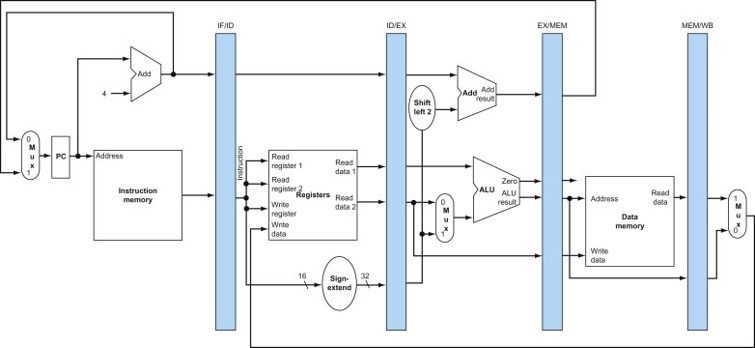
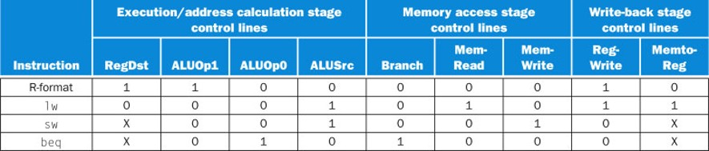

오늘날 단일 사이클 구현은 사용되지 않는다.  

왜냐하면, 명령어마다 시간이 다 다르기 때문이다.  
특히 lw 명령어는  
명령어 메모리 -> 레지스터 -> ALU -> 데이터 -> 레지스터 순으로 길다.  

단일 사이클로 구현하게 되면  
간단하고 이해하기는 쉬우나,  
CPI = 1로 통일되지만 클럭 사이클이 길어지는 단점이 있다.  

그렇다고 가변 클럭 사이클을 하기엔, 성능은 좋으나 구현은 불가능하다.  

따라서 파이프라이닝 기술을 도입한다.  

## 파이프라이닝

파이프라이닝은 여러 명령어가 중첩되어 실행되는 구현 기술이다.  
명령어 수준의 병렬성을 활용한다.  
각 명령어의 실행시간은 개선 못하나 처리량을 개선한다.  

명령어의 단계마다 사용되는 유닛이 있는데,  
이는 자기 차례가 오기 전이나 지난 후에는 아무 일도 안 한다.  
이 낭비되는 시간을 줄여야 하는 것이다.  

단 이를 위해선 사이클의 간격은 일정해야 하므로  
명령어의 단계별 처리 시간이 늘어날 수가 있다.  

### 파이프라인의 성능

파이프라인 클럭의 속도는 가장 느린 단계에 의해 결정된다.  

완벽하게 균형 잡힌 파이프라인은  
모든 단계의 처리 시간이 같은 파이프라인인데  
이때 무한히 많은 명령어를 실행한다 가정할 때  
단계 수만큼 속도가 증가한다.  

명령어는 가장 사이클이 많이 도는 lw 기준으로 잡아서 5사이클이 기본이다.  
이때 명령어 n 개를 파이프라이닝을 하지 않으면 5n 사이클이 돌지만,  
파이프라이닝을 사용할 경우 5 + (n-1) 사이클이 돈다.  

## 파이프라인 해저드

파이프라이닝의 핵심은, 명령어의 실행을 겹쳐놓는 것이다.  
이때, 아직 처리되지 않은 결과를 다음 명령어에서 사용해야 할 때가 있는데  
이를 해저드라고 한다.  

해저드는 다음과 같은 경우가 있다.  

1. 구조적 해저드 (Structural Hazard)  
  - 다른 단계에 있는 명령어들이 동시에 같은 자원을 사용하려고 하는 상황  
  - 해결 방법 : 해당 자원을 여러 개 설치  
  
2. 데이터 해저드 (Data Hazard)  
  - 앞의 명령어의 결과를 사용해야 하는ㄷ, 앞의 명령어가 끝나지 않아 아직 사용 불가  
  - 해결 방법 : 파이프라인 지연, 전방전달  
  
3. 제어 해저드 (Control Hazard)  
  - 앞의 분기 명령어가 분기할 지 안 할 지 몰라서 다음 명령어 인출 불가  
  - 해결 방법 : 파이프라인 지연, 분기 예측, 지연 분기
  
  
## 명령어 단계에 따른 파이프라인의 5단계

1. IF (Instruction Fetch) : 명령어 인출  
2. ID (Instruction Decode) : 명령어 해독 및 레지스터 파일 읽기  
3. EX (Execution) : 실행 및 주소 계산  
4. MEM (Memory) : 데이터 메모리 접근  
5. WB (Write Back) : 레지스터에 쓰기  

명령어 단계와 같이 IF와 ID는 공통적이다.  

이때 WB 단계에서 데이터 해저드가 발생하고  
MEM 단계에서 PC 값을 4 증가된 값으로 할 지, 분기할 주소로 할 지를 선택하면서  
제어 해저드가 발생한다.  

## 파이프 라인 데이터 패스 

파이프라인 사이사이에 레지스터를 두어서  
다음 파이프라인에서 필요한 정보를 백업해둔 후 다음 명령어를 실행한다.  

IF 단계의 lw 명령어

1. pc의 값을 읽는다.  
2. 이를 IF/ID 레지스터에 적는다.  

ID 단계  

3. IF/ID 에서 읽은 명령에 따라 rs, rt 를 읽는다.  
4. ID/EX 레지스터에 적는다.  

EX 단계  

5. ID/EX 에서 읽은 rs, rt, address 를 계산  
6. EX/MEM 에 저장  

MEM 단계  

7. EX/MEM 에 있는 값을 MEM/WB 레지스터에 저장  

WB 단계  

8. MEM/WB의 값을 레지스터에 저장한다.  

### 제어신호

파이프라인 단계에 따라  
이전에 이야기했던 제어신호는 이렇게 나뉜다.  

1. IF : 없다. 항상 같은 일이 일어난다.  
2. ID : 없다. 역시 항상 같다.  
3. EX : RegDst, ALUOp, ALUSrc  
4. MEM : Branch, MemRead (lw 에서 1), MemWrite (sw 에서 1)  
5. WB : MemToReg, RegWrite  

정리된 제어신호의 표는 다음과 같다.  

