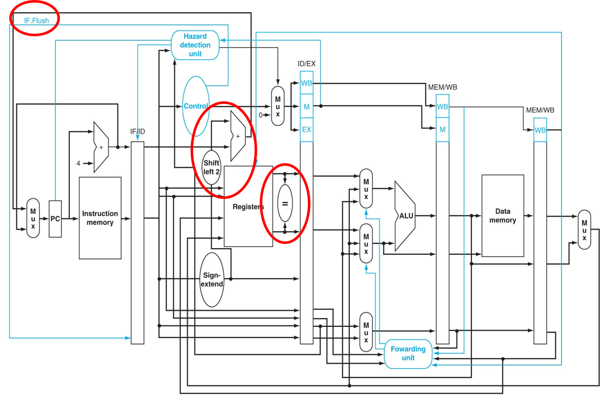

해저드의 종류엔 세 가지가 있다.  
1. 구조적 해저드  
2. 데이터 해저드  
3. 제어 해저드  

이번엔 제어 해저드에 대해서 알아보자.  

## 제어 해저드 

인출한 명령어가 필요한 명령어가 아니기 때문에  
적절한 명령어가 적절한 클럭 사이클에 실행될 수 없는 사건  

명령어 주소의 흐름이 파이프라인이 기대한 것과 다르기 때문에 발생  

매 클럭마다 명령어를 인출해야 하나,  
분기 명령어의 경우 인출할 다음 명령어를 바로 알 수가 없다.  

해결 방법
- 분기 시 지연  
- 분기 예측  
- 지연 분기  


### 분기 명령어에 대한 파이프라인의 영향

`beq $1, $3, 28` 이란 명령어를 실행했다고 하자.  
1. 인출  
2. 해독  
3. 비교, 주소 계산  
4. PC 결정  

의 단계를 거치므로 MEM 에서야 분기 여부가 결정되고 그 후에 주소가 생성이 된다.  

분기를 해야 했을 명령어라면, 이미 분기가 결정됐을 땐 그 다음 세 줄이 다 실행될 후일 것이다.  


### 해결 방법 1 - 분기 시 지연

분기가 MEM 단계에서 실행되므로, 3클럭 분기 손실이 일어난다.  

```MIPS
beq $1,$3, 28
and $12, $2, $5
``` 

같은 경우 둘 사이에 세 번의 버블이 들어가는 것이다.  

#### 분기 성능 향상

따라서 이 버블을 줄이기 위해 다음 PC 값을 MEM 이 아닌 ID 단계에서 선정하자.  
이렇게 되면 3개가 아닌 1번만 지연하면 된다.  

이를 구현하기 위해 데이터패스를 수정하자.  

#### 데이터 패스 수정 

분기 목적지 주소 계산과 분기 조건 검사를 ID 단계에서 실행하자.  
이를 위해서  
1. 분기 덧셈기를 ID 단계로 이동하고  
2. ID 단계에 비교기를 추가한다.  

원래는 EX 단계에서 있는 ALU 를 썼지만  
지금은 새로 추가된 비교기를 쓴다.  

#### 제어신호 추가

IF.Flush 제어신호를 추가한다.  
이는 IF/ID 레지스터의 필드를 0으로 바꾼다. (nop 명령어)  
따라서 분기가 일어난다면 이 명령을 실행하지 않는다.  

#### 완성된 데이터패스와 제어



beq 가 판별 되면 일단 IF.Flush 를 1로 해서 한 번 멈추고 간다.  


#### 분기 시 지연, 그 성능

분기 실행 빈도를 17%라 했을 때  
분기할 때마다 1씩 지연한다면  
평균 CPI 는 1.17배 증가하여  
성능도 17% 저하될 것이다.  


### 해결방법 2 - 분기 예측

파이프라인이 길어지면 분기 결과를 결정하는데 오래 걸린다.  
분기 명령어가 나올 때마다 1 지연하는 것은 비효율적.  
실제 분기 결과가 확인될 때까지 기다리는 대신,  
분기 결과를 가정하고  
그 가정 하에 파이프라인을 진행하자.  

분기 결과 예측이 맞으면 지연 없이 진행하고  
틀렸으면 지연을 넣어주자.  


#### 정적 및 동적 분기 예측

정적 분기 예측은  
프로그램 실행 전에 분기 방향 예측을 한다.  
분기 명령어 자체에 대한 통계적인 정보로 예측한다.  

동적 분기 예측은  
실행 시 수집한 정보를 이용해 분기를 예측한다.  
프로그램 실행하면서 하드웨어가 분기 이력을 기록한다.  

동적은 사람이 코드를 짜는 습관에 맞추는 것이다.  
물론 동적이 더 예측을 잘한다.  


|정적|동적|
|:---:|:---:|
|분기가 일어난다고 가정|분기 예측 버퍼|
|분기가 일어나지 않는다 가정|연관 분기 예측|
|Opcode에 따라 예측|토너먼트 분기 예측|
|분기 방향에 따라 예측|분기 목적지 버퍼|


#### 분기가 일어나지 않는다 가정

안 일어나면 나이스  
일어나면 인출된 명령어 버리고 분기 목적지에서 실행  
- 원래의 제어값 0으로 바꾼다.  
- 분기 명령어가 MEM 단계에서 실행된다면 IF, ID, EX 단계의 명령어 제거
- ID 에서 실행된다면 IF 단계의 명령어 하나 제거


#### 동적 분기 예측 

동적 분기 예측 :   
실행 정보를 이용  
명령어 주소를 살펴서 지난 번 실행 시 분기 여부 예측  
지난 번과 같은 방향에서 다음 명령어 인출  

분기 이력표 (Branch History Table) :  
분기 명령어 주소의 하위비트에 의해 인덱싱됨.  
최근에 분기가 일어났는지 아닌지를 나타냄.  
만약 이 표대로 했는데 틀렸으면 버블로 지연, 복구하고 업데이트  

결론 :  
분기 명령어을 실행할 땐  
BHT를 검사해서 예측하고  
그 결과의 것을 바로 실행.  
예측이 틀렸으면 파이프라인 비우고 예측 방향 수정  


#### 순환문

순환문, 반복문은 총 10번 반복하면 9번 분기 일어나고 1번 분기 안 한다.  
즉 전체의 90%가 분기를 한다.  
분기를 안 한다고 예측을 했다면  
첫번째 beq 에서 실패  
그 후 계속 분기하다가 마지막 반복에서 분기를 안 해야 하므로 또 실패.  
따라서 예측 정확도는 80%가 된다.  

반복 횟수가 커지면 이 정확도는 늘어날 것.

#### 2비트 분기 예측 방법

예측이 연속 두 번 틀려야 예측 방향을 바꾼다.  
두 번 틀릴 것을 한 번만 틀리게 한다.  


