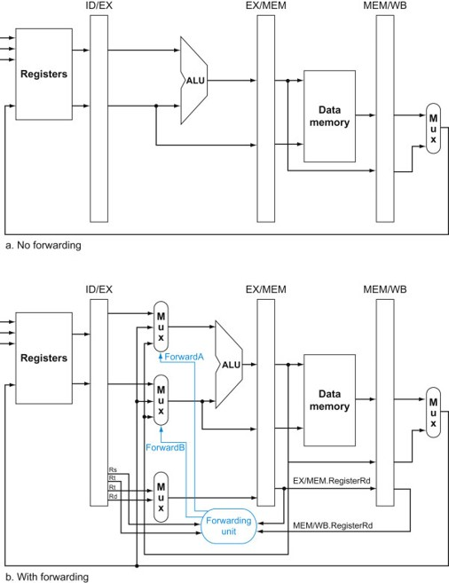

## 해저드 조건

1a. EX/MEM.RegisterRd = ID/EX.RegisterRs  
1b. EX/MEM.RegisterRd = ID/EX.RegisterRt  
2a. MEM/WB.RegisterRd = ID/EX.RegisterRs  
2b. MEM/WB.RegisterRd = ID/EX.RegisterRt  

뒤의 명령어에서 계산하려는 레지스터가 앞의 명령어의  
1유형 : EX/MEM 단계에서 사용되고 있을 때     
2유형 : MEM/WB 단계에서 사용되고 있을 때  


예)  

```MIPS
sub  	$2,  $1, $3 
and  	$12, $2, $5
or   	$13, $6, $2 
add  	$14, $2, $2  
sw	$15, 100($2)
```

sub과 and 사이에서는 1a 해저드 발생  
- and 에서 쓰는 2번 레지스터는 현재 sub 의 EX/MEM 에서 사용 중  

sub과 or 사이에서는 2b 해저드 발생  
- or 에서 쓰는 2번 레지스터는 현재 sub 의 MEM/WB 에서 사용 중

sub 과 add, sub 과 sw 사이에서는 종속성은 있으나 해저드 발생 x  


또한,  
레지스터 쓰기를 하지 않는 명령어나,  
목적지의 레지스터가 $0 인 레지스터에서는 해저드가 발생하지 않아  
전방전달을 할 필요가 없다.  


### 전방전달을 위한 유닛과 MUX 추가

MUX :  
전방전달 받은 측에서는  
값을 내가 읽은 명령어의 레지스터 주소에서 바로 가져올 것인지  
아니면 전방전달 된 값으로 연산을 진행할 것인지 판별 필요  

Forwarding Unit :  
전 명령어의 쓰기하는 레지스터가 0인지를 가져온다.  
이후 결과에 따라서 MUX 들을 제어한다.  


전방전달 유무에 따른 회로 비교




### 전방전달 MUX의 제어신호

|MUX 제어신호|근원지|설명|
|:---:|:---:|:---:|
|forwardA = 00|ID/EX|ALU의 첫번째 피연산자가 레지스터 파일에서 온다.|
|forwardA = 10|EX/MEM|ALU의 첫번째 피연산자로 직전 명령어의 ALU 결과가 전방전달 (1a 해저드)|
|forwardA = 01|MEM/WB|ALU의 첫번째 피연산자로 데이터 메모리에서 읽은 값 또는 전전 명령어의 ALU 결과가 전방전달(2a)|
|forwardB = 00|ID/EX|ALU의 두번째 피연산자가 레지스터 파일에서 온다.|
|forwardB = 10|EX/MEM|ALU의 두번째 피연산자로 직전 명령어의 ALU 결과가 전방전달 (1b)|
|forwardB = 01 |MEM/WB|ALU의 두번째 피연산자로 데이터 메모리에서 읽은 값 또는 전전 명령어의 ALU 결과가 전방전달 된다.(2b)|


### 이중 데이터 해저드

```MIPS
add $1, $1, $2
add $1, $1, $3
add $1, $1, $4
```

1번 레지스터에다가 2번, 3번, 4번 레지스터 값을 연속해서 더하는 코드이다.  
당연히 둘째 줄에서 1a, 셋째 줄에서 2a 해저드가 발생할 것이다.  
이때의 전방전달은 두 값 중 최신의 값을 사용해야 하므로  
종류 1 해저드로 인식을 먼저 하고 전방전달한다.  
종류 2 해저드는 1이 없을 때만 한다.  

### 완성된 전방전달 제어식

결론적으로 데이터 해저드는  

앞의 명령어가 연산 후 RegWrite 하는 명령어이고  
그 목적지 레지스터는 0번 레지스터가 아님과 동시에  
지금 참조하려는 소스 레지스터와 같을 때 ForwardA = 10 을 발생하고 (1a)  

그게 아니라 앞앞의 명령어가 연산 후 RegWrite 하는 명령어이고  
그 목적지 레지스터는 0번 레지스터가 아님과 동시에  
지금 참조하려는 소스 레지스터와 같을 때 ForwardA = 01 을 발생하고 (2a)  

이들 중 단 하나도 해당하지 않는다면 전방전달을 하지 않는다. ForwardA = 00  

또한,  

앞의 명령어가 연산 후 RegWrite 하는 명령어이고  
그 목적지 레지스터는 0번 레지스터가 아님과 동시에  
지금 참조하려는 타겟 레지스터와 같을 때 ForwardB = 10 을 발생하고 (1b)  

그게 아니라 앞앞의 명령어가 연산 후 RegWrite 하는 명령어이고  
그 목적지 레지스터는 0번 레지스터가 아님과 동시에  
지금 참조하려는 타겟 레지스터와 같을 때 ForwardB = 01 을 발생하고 (2b)  

이들 중 단 하나도 해당하지 않는다면 전방전달을 하지 않는다. Forward = 00  

